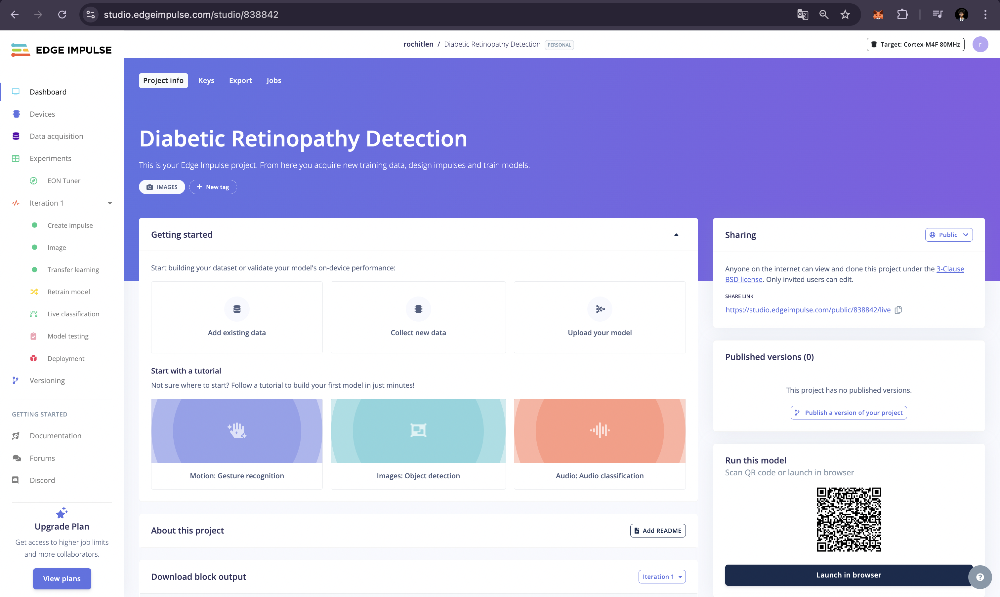
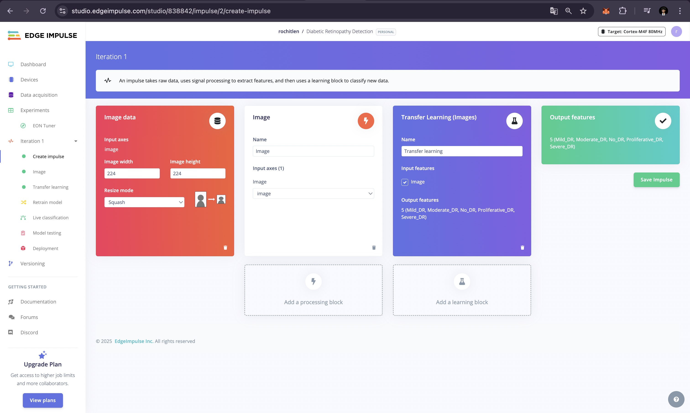
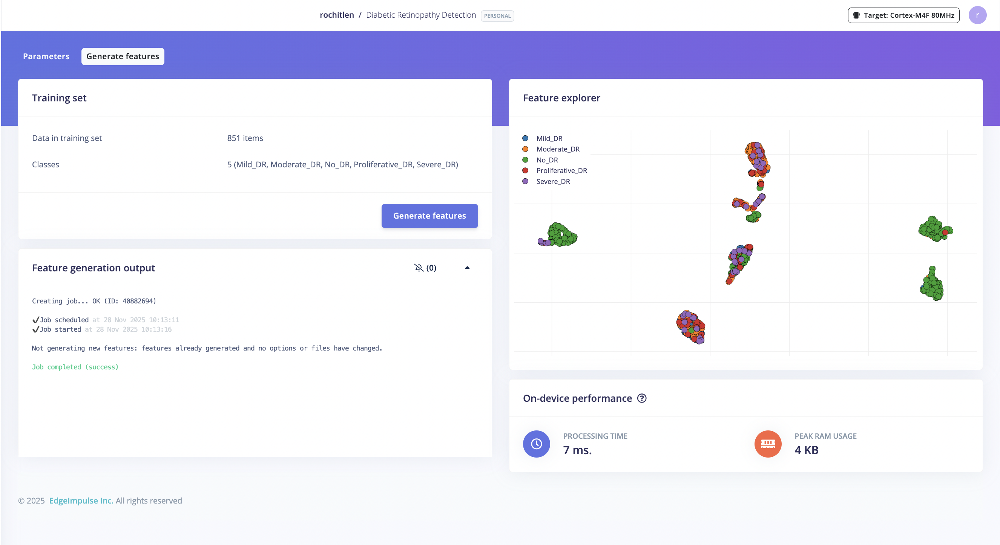
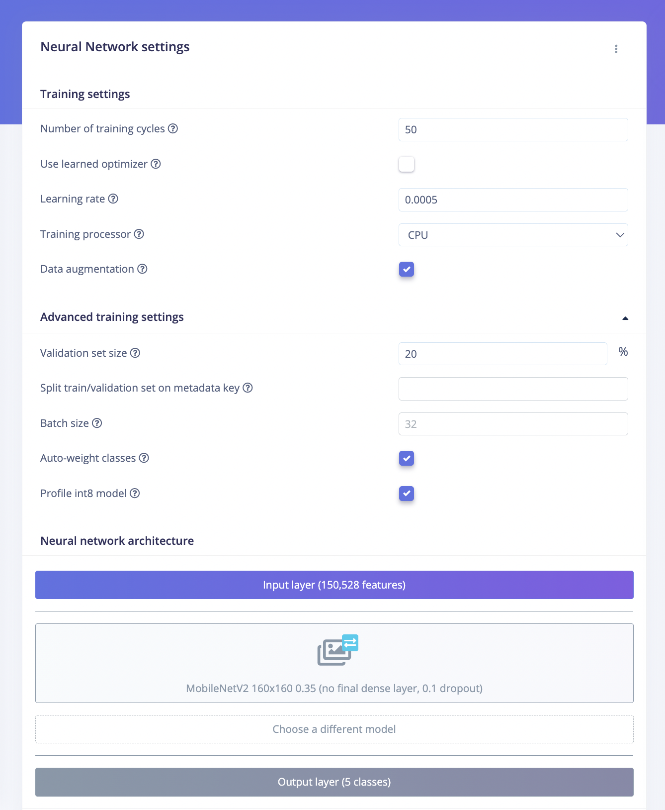
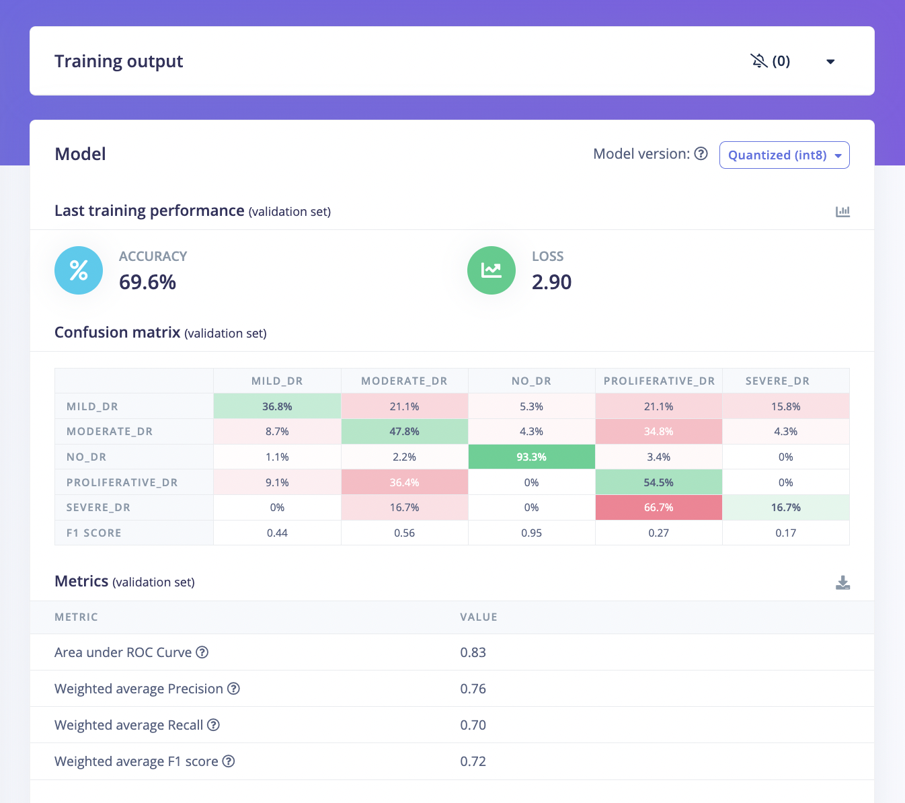
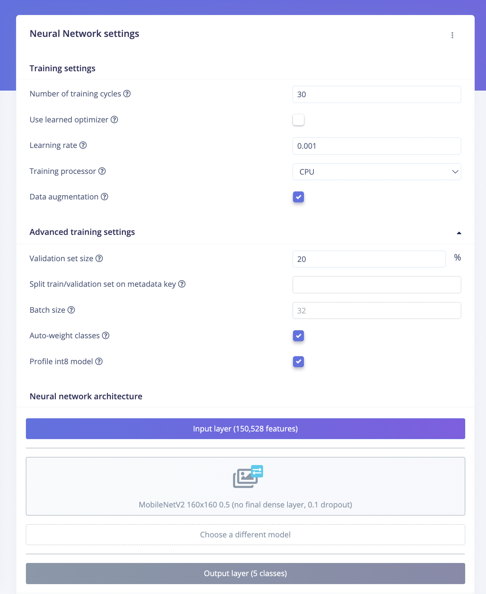
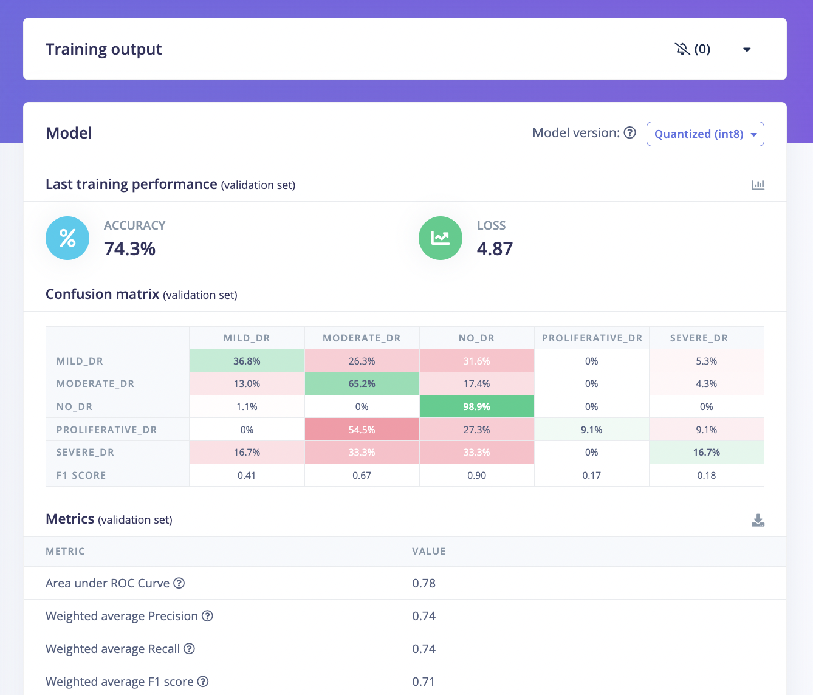
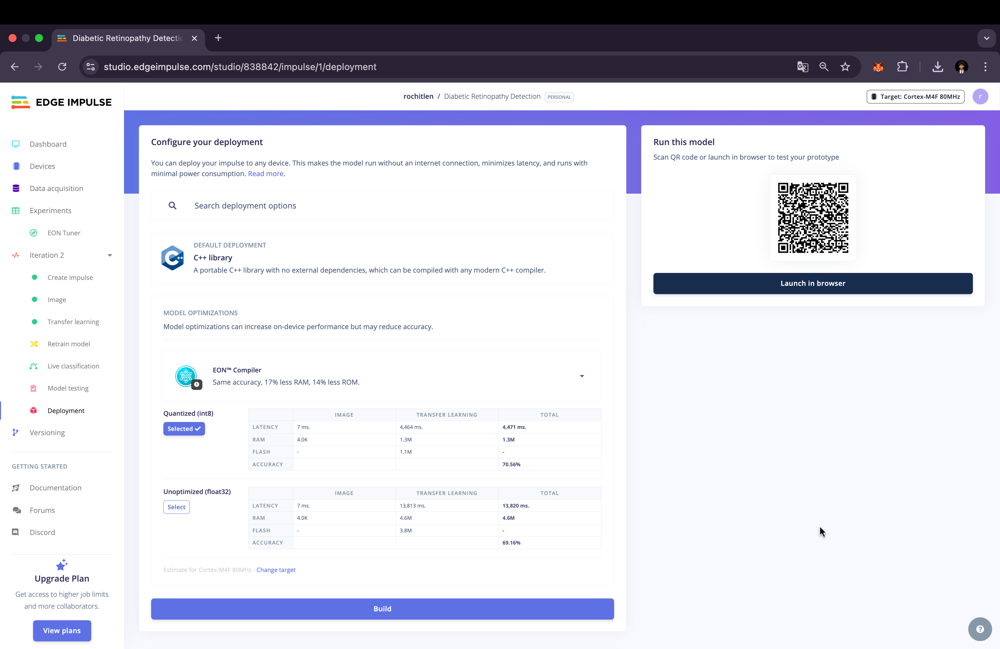
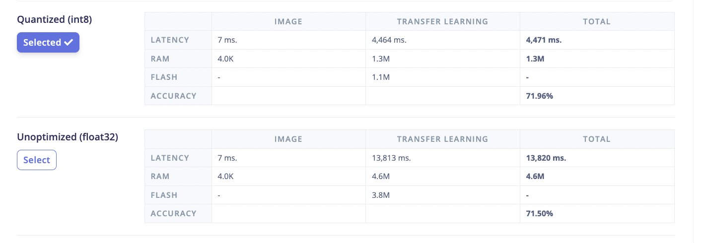
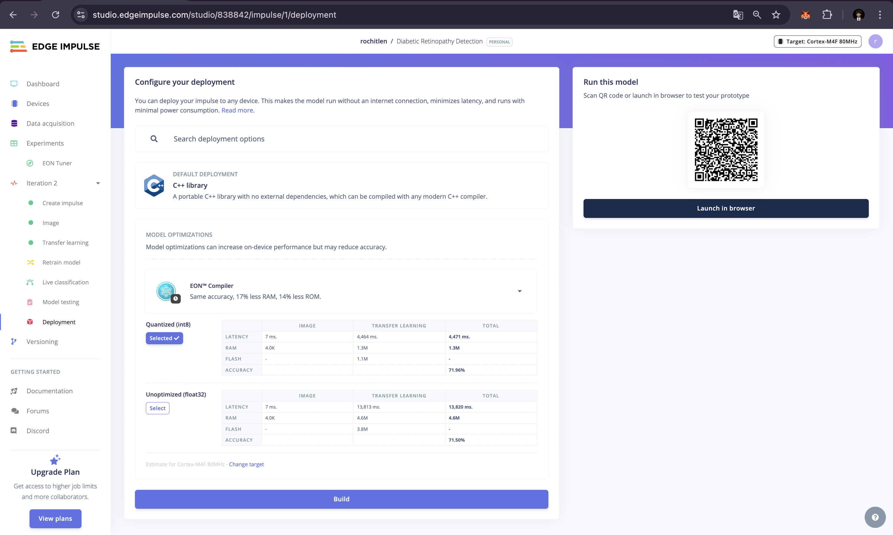

# Diabetic Retinopathy Detection on Edge AI Devices

## Project Overview

This project focuses on developing a high-performance, efficient machine learning model for diabetic retinopathy (DR) detection using retinal fundus images. The model is built using Edge Impulse Studio and optimized for deployment on Edge AI devices, enabling accessible healthcare diagnostics in remote or resource-constrained environments.

## Problem Statement

Diabetic retinopathy is a major cause of blindness in diabetic patients worldwide. Early detection through AI-driven edge devices can revolutionize healthcare delivery by providing:
- **Accessibility**: Deployable in remote clinics and resource-limited settings
- **Speed**: Real-time diagnosis without cloud connectivity
- **Cost-effectiveness**: Reduced need for specialist consultations
- **Scalability**: Widespread screening capabilities

## Project Goals

- ✅ Build at least one trained ML model using Edge Impulse Studio
- ✅ Use high-quality, open-source retinal fundus image datasets
- ✅ Achieve high model accuracy through iterative optimization
- ✅ Optimize for edge deployment (memory, latency, computational efficiency)
- ✅ Document complete development pipeline and research process

## Project Structure

```
RetinaX/
├── README.md                          # This file
├── docs/
│   ├── dataset_documentation.md      # Dataset source, licensing, preprocessing
│   ├── model_development.md          # Model architecture and training details
│   ├── validation_results.md         # Performance metrics and evaluation
│   └── research_log.md               # Iterative experiments and improvements
├── data/
│   ├── raw/                          # Original dataset files
│   ├── processed/                    # Preprocessed images ready for Edge Impulse
│   └── metadata/                     # Labels, annotations, and metadata
├── scripts/
│   ├── data_preparation.py           # Data preprocessing and preparation
│   ├── dataset_split.py              # Train/validation/test split
│   └── [other utility scripts]
├── models/
│   └── edge_impulse_models/          # Exported Edge Impulse models
└── config/
    └── project_config.yaml           # Project configuration
```

## Dataset Information

**Primary Dataset**: EyePACS (Kaggle) or similar open-source retinal fundus image datasets

**License**: Open-source with permissive commercial use license

**Classes**:
- No DR (No Diabetic Retinopathy)
- Mild DR
- Moderate DR
- Severe DR
- Proliferative DR

**Dataset Details**: See `docs/dataset_documentation.md` for complete information.

## Model Development

### Architecture
- **Base Model**: MobileNet, ShuffleNet, or custom lightweight CNN
- **Optimization**: Quantization-aware training, post-training quantization
- **Input**: Retinal fundus images (resized and normalized)

### Training Strategy
- Data augmentation (rotations, flips, contrast adjustments)
- Cross-validation for robust evaluation
- Hyperparameter tuning using Edge Impulse tools
- Class imbalance handling

### Performance Metrics
- Accuracy
- Precision, Recall, F1-Score
- Confusion Matrix
- Inference latency
- Model size and memory footprint

## Edge Deployment

The model is optimized for:
- **Memory**: < 2MB model size
- **Latency**: < 100ms inference time
- **Hardware**: ARM Cortex-M series, ESP32, Raspberry Pi, or similar edge devices

## Getting Started

### Prerequisites
- Python 3.8+
- Edge Impulse Studio account
- Access to retinal fundus image dataset

### Setup Instructions

1. **Clone and navigate to the project**:
   ```bash
   cd RetinaX
   ```

2. **Install dependencies**:
   ```bash
   pip install -r requirements.txt
   ```

3. **Download and prepare dataset**:
   ```bash
   # Option 1: Auto-setup (creates structure + instructions)
   python scripts/download_dataset.py 1
   
   # Then download Mendeley dataset from:
   # https://data.mendeley.com/datasets/nxcd8krdhg/1
   # Organize images in data/raw/ by class (0-4)
   
   # Option 2: If you already downloaded a dataset
   python scripts/process_downloaded_dataset.py /path/to/dataset
   
   # Then prepare the data
   python scripts/data_preparation.py
   ```
   
   See `DATASET_SETUP.md` for detailed download instructions.

4. **Upload to Edge Impulse Studio**:
   - Follow instructions in `docs/model_development.md`
   - Upload data manually via Edge Impulse Studio web interface

5. **Train and optimize model**:
   - Use Edge Impulse Studio's training interface
   - Document experiments in `docs/research_log.md`

## Documentation

- **Dataset Documentation**: `docs/dataset_documentation.md`
- **Model Development**: `docs/model_development.md`
- **Validation Results**: `docs/validation_results.md`
- **Research Log**: `docs/research_log.md`

## Development Process & Visual Documentation

This section documents the complete development pipeline with visual evidence from Edge Impulse Studio.

### Phase 1: Data Preparation & Analysis

#### Dataset Distribution
The dataset was analyzed to understand class distribution and balance across splits.


*Class distribution visualization showing the balance across 5 DR severity classes*

#### Data Preparation Output
The preprocessing pipeline processed and validated all images for quality and consistency.


*Data preparation script output showing preprocessing statistics and quality checks*

#### Dataset Split Analysis
Stratified split was performed to maintain class distribution across train/validation/test sets.


*Analysis of train/validation/test split showing class balance across all splits*

### Phase 2: Edge Impulse Studio Setup

#### Project Dashboard
Created and configured the Edge Impulse project for diabetic retinopathy detection.


*Edge Impulse Studio project dashboard showing project overview and navigation*

#### Data Acquisition
Uploaded and organized training and validation datasets with proper class labels.


*Data acquisition page showing uploaded dataset with class labels (No_DR, Mild_DR, Moderate_DR, Severe_DR, Proliferative_DR)*

#### Impulse Design
Configured the complete ML pipeline from input to classification.


*Impulse design showing the complete pipeline: Image (160×160) → Transfer Learning → Classification (5 classes)*

#### Feature Generation
Generated features from all training images for model training.


*Feature generation process completion in Edge Impulse Studio*

### Phase 3: Model Training - Iteration 1

#### Transfer Learning Configuration (Iteration 1)
Baseline model configuration with MobileNetV2 0.35 variant.


*Iteration 1 configuration: MobileNetV2 160×160 0.35, Learning Rate 0.0005, 50 training cycles*

#### Training Output (Iteration 1)
Validation performance metrics from Iteration 1 training.


*Iteration 1 training results: 69.6% validation accuracy, ROC AUC 0.83, Weighted F1-Score 0.72*

#### Training Graph (Iteration 1)
Training progress visualization showing accuracy and loss curves.


*Iteration 1 training curves showing accuracy and loss progression over 50 training cycles*

#### Confusion Matrix (Iteration 1)
Validation set confusion matrix showing per-class performance.


*Iteration 1 confusion matrix: No_DR (93.3%), Moderate_DR (47.8%), showing baseline performance*

### Phase 4: Model Training - Iteration 2

#### Transfer Learning Configuration (Iteration 2)
Optimized model configuration with increased capacity and adjusted hyperparameters.


*Iteration 2 configuration: MobileNetV2 160×160 0.5, Learning Rate 0.001, 30 training cycles*

#### Training Output (Iteration 2)
Improved validation performance metrics from Iteration 2.


*Iteration 2 training results: 74.3% validation accuracy ⬆️ (+4.7%), ROC AUC 0.78, Weighted F1-Score 0.71*

#### Training Graph (Iteration 2)
Training progress visualization showing improved convergence.


*Iteration 2 training curves showing improved accuracy and loss progression over 30 training cycles*

#### Confusion Matrix (Iteration 2)
Validation set confusion matrix showing improved per-class performance.


*Iteration 2 confusion matrix: No_DR (98.9% ⬆️), Moderate_DR (65.2% ⬆️), showing significant improvement*

### Phase 5: Model Testing

#### Model Testing Output
Final test set evaluation with quantized INT8 model.


*Model testing results: 71.96% test accuracy (INT8 quantized), ROC AUC 0.74, Weighted F1-Score 0.69*

#### Test Confusion Matrix
Test set confusion matrix showing final model performance.


*Test set confusion matrix: No_DR (95.3%), Moderate_DR (77.4%), showing excellent generalization*

#### Validation vs Test Comparison
Comparison between validation and test set performance demonstrating good generalization.


*Validation vs Test comparison: 74.3% validation → 71.96% test (2.34% difference, excellent generalization)*

### Phase 6: Model Deployment

#### Deployment Configuration
Edge deployment setup with C++ library for Cortex-M4F devices.


*Deployment page showing C++ Library configuration and INT8 quantized model selection*

#### Deployment Performance Metrics
Performance comparison between INT8 quantized and Float32 unoptimized models.


*Performance metrics: INT8 (1.1MB, 4,471ms) vs Float32 (3.8MB, 13,820ms) showing 68% latency reduction*

#### Build Completion
Successful model build and deployment package generation.


*Build completion screen showing successful deployment package generation*

## Results

See `docs/validation_results.md` for detailed performance metrics and evaluation results.

**Final Model Performance:**
- **Test Accuracy**: 71.96% (INT8 Quantized)
- **Validation Accuracy**: 74.3%
- **Model Size**: 1.1 MB
- **Inference Latency**: 4,471 ms
- **Target Device**: Cortex-M4F 80MHz

## License

This project uses open-source datasets with permissive licenses. Please refer to individual dataset licenses for usage terms.

## Acknowledgments

- Edge Impulse Studio for the ML platform
- EyePACS and other open-source retinal image dataset providers
- Healthcare community for advancing accessible diagnostics

## Contact

For questions or contributions, please refer to the hackathon submission guidelines.

