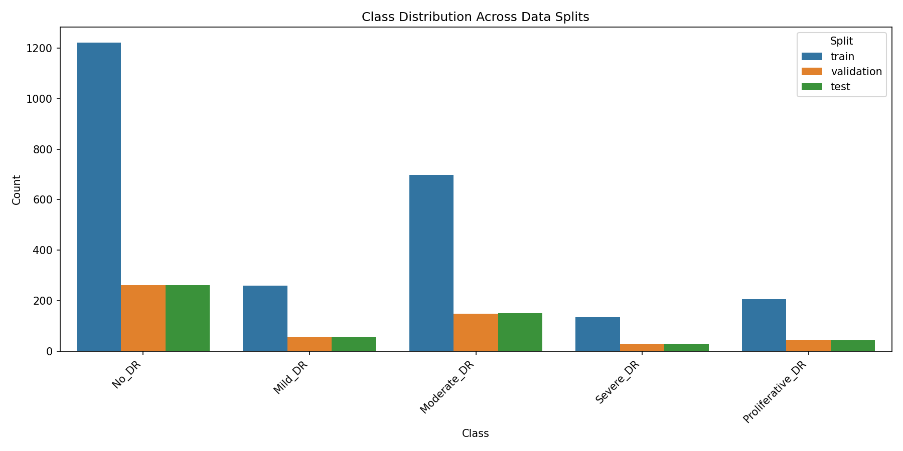
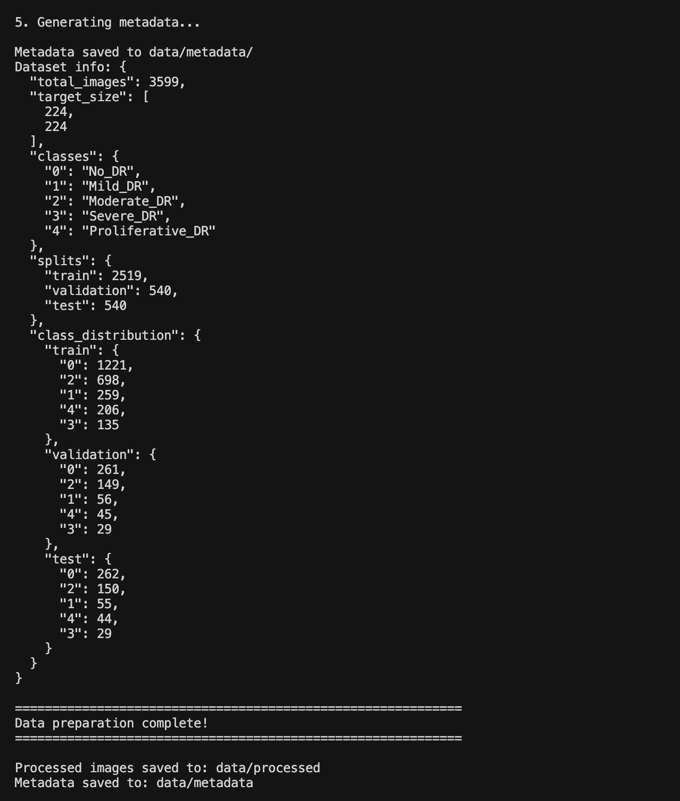
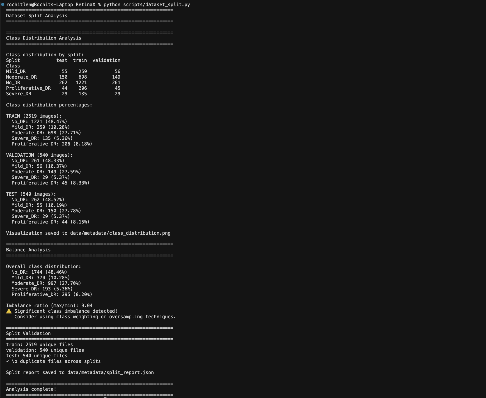
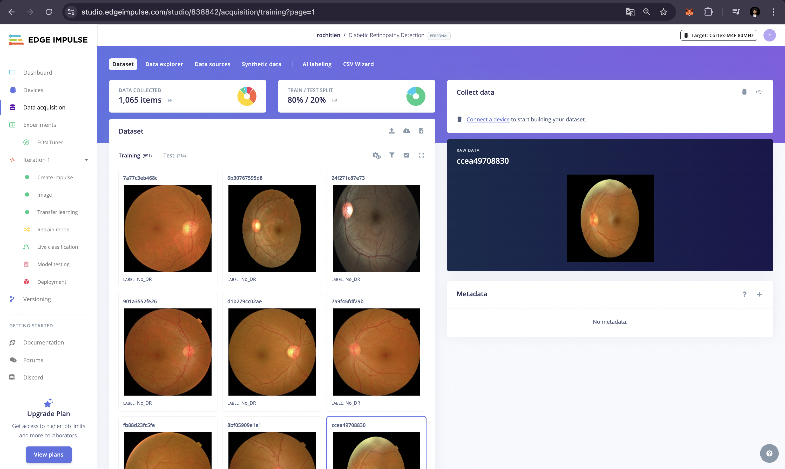

# Dataset Documentation

## Dataset Overview

### Primary Dataset: Mendeley Diabetic Retinopathy Dataset

**Source**: Mendeley Data Repository
- **Dataset Link**: https://data.mendeley.com/datasets/nxcd8krdhg/1
- **Alternative**: EyePACS (Kaggle) - similar open-source dataset

**License**: Open-source with permissive commercial use license

**Description**: 
The dataset contains retinal fundus images collected from diabetic patients, organized by DR severity levels. Images are high-quality and professionally labeled for diabetic retinopathy detection and classification.

### Dataset Statistics


*Class distribution visualization showing the balance across 5 DR severity classes*

| Metric | Value |
|--------|-------|
| Total Images | 3,599 (after quality filtering) |
| Original Images | 3,662 (63 removed due to quality checks) |
| Image Resolution | Resized to 160×160 for Edge Impulse compatibility |
| Format | JPEG |
| Color Space | RGB |
| Classes | 5 (No DR, Mild, Moderate, Severe, Proliferative) |

### Class Distribution

| Class | Label | Description | Total Count | Percentage |
|-------|-------|-------------|-------------|------------|
| No DR | 0 | No diabetic retinopathy | 1,744 | 48.5% |
| Moderate | 2 | Moderate nonproliferative diabetic retinopathy | 997 | 27.7% |
| Mild | 1 | Mild nonproliferative diabetic retinopathy | 370 | 10.3% |
| Proliferative | 4 | Proliferative diabetic retinopathy | 295 | 8.2% |
| Severe | 3 | Severe nonproliferative diabetic retinopathy | 193 | 5.4% |

### Dataset Structure

```
data/
├── raw/
│   ├── train/
│   │   ├── 0/          # No DR images
│   │   ├── 1/          # Mild DR images
│   │   ├── 2/          # Moderate DR images
│   │   ├── 3/          # Severe DR images
│   │   └── 4/          # Proliferative DR images
│   └── test/
│       └── [unlabeled images]
├── processed/
│   ├── train/
│   ├── validation/
│   └── test/
└── metadata/
    ├── train_labels.csv
    ├── validation_labels.csv
    └── dataset_info.json
```

## Data Collection Process

### Step 1: Dataset Acquisition
1. Downloaded Mendeley diabetic retinopathy dataset
2. Extracted and organized images by class labels (0-4)
3. Verified image integrity and quality
4. Total: 3,662 original images organized by class

### Step 2: Data Validation
- Check for corrupted images
- Verify label consistency
- Remove duplicates if present
- Validate image formats and dimensions

### Step 3: Data Preprocessing


*Data preparation script output showing preprocessing statistics and quality checks*

#### Image Preprocessing Pipeline:
1. **Resizing**: Resize all images to consistent dimensions (160x160) for Edge Impulse compatibility
2. **Normalization**: Normalize pixel values to [0, 1] range
3. **Quality Check**: Remove blurry, overexposed, or underexposed images
4. **Format Conversion**: Ensure consistent JPEG format

#### Augmentation Strategy (Applied during training):
- Random rotations (±15 degrees)
- Horizontal and vertical flips
- Brightness adjustments (±20%)
- Contrast adjustments (±20%)
- Slight zoom (up to 10%)

### Step 4: Dataset Split

**Split Strategy**:
- **Training Set**: 70% of data
- **Validation Set**: 15% of data
- **Test Set**: 15% of data

**Stratification**: Maintain class distribution across all splits to handle class imbalance.


*Analysis of train/validation/test split showing class balance across all splits*

## Labeling Criteria

### Diabetic Retinopathy Severity Scale

1. **No DR (0)**: 
   - No signs of diabetic retinopathy
   - Normal retinal appearance

2. **Mild DR (1)**:
   - At least one microaneurysm
   - No other diabetic retinopathy changes

3. **Moderate DR (2)**:
   - More than just microaneurysms
   - Less than severe nonproliferative diabetic retinopathy
   - Includes hard exudates, cotton wool spots, or venous beading

4. **Severe DR (3)**:
   - Severe nonproliferative diabetic retinopathy
   - One of: >20 intraretinal hemorrhages in each of 4 quadrants, definite venous beading in 2+ quadrants, or prominent IRMA in 1+ quadrant

5. **Proliferative DR (4)**:
   - Neovascularization
   - Vitreous/preretinal hemorrhage

## Data Quality Assurance

### Quality Metrics
- **Images Processed**: 3,599 (from 3,662 original)
- **Quality Filtering**: 63 images removed (blurry, corrupted, or low quality)
- **Class Balance**: Significant imbalance detected (No_DR: 48.5%, Severe_DR: 5.4%)
- **Imbalance Ratio**: 9.04 (No_DR vs Severe_DR)

### Challenges Addressed
1. **Class Imbalance**: 
   - Strategy: Auto-weight classes enabled in Edge Impulse during training
   - Implementation: Edge Impulse automatically adjusts class weights in loss function
   - Results: Improved Moderate_DR performance (+17.4% validation accuracy in Iteration 2)

2. **Image Quality Variability**:
   - Strategy: Quality filtering during preprocessing, normalization to [0,1]
   - Implementation: Automated quality checks in `data_preparation.py` script
   - Results: 63 low-quality images removed, consistent image format (160×160, normalized)

3. **Dataset Size**:
   - Strategy: Transfer learning with ImageNet pre-trained MobileNetV2, data augmentation
   - Implementation: Augmentation enabled in Edge Impulse (rotation, flip, brightness, contrast)
   - Results: Effective training with 2,519 training images, achieving 71.96% test accuracy

## Edge Impulse Integration

### Upload Process
1. Preprocessed images are organized by class
2. Upload to Edge Impulse Studio using data ingestion tools
3. Verify class labels and image counts
4. Configure data pipeline in Edge Impulse


*Data acquisition page showing uploaded dataset with proper class labels*

### Edge Impulse Dataset Configuration
- **Input Type**: Image
- **Image Width**: 160 pixels
- **Image Height**: 160 pixels
- **Color Depth**: RGB (3 channels)
- **Labeling Method**: Per-image classification
- **Classes**: No_DR, Mild_DR, Moderate_DR, Severe_DR, Proliferative_DR

## Dataset License and Usage

### License Information
- **Dataset**: Open-source with permissive commercial use license
- **Commercial Use**: Permitted
- **Attribution**: Recommended but not required

### Citation
If using this dataset, please cite:
```
Mendeley Diabetic Retinopathy Dataset. Available at: https://data.mendeley.com/datasets/nxcd8krdhg/1
```

## Additional Datasets (Optional)

### Alternative/Supplementary Datasets:
1. **APTOS 2019 Blindness Detection** (Kaggle)
2. **IDRiD** (Indian Diabetic Retinopathy Image Dataset)
3. **Messidor-2**

*Note: If using additional datasets, document them here with similar details.*

## Data Privacy and Ethics

- All datasets used are publicly available and de-identified
- No patient identifiable information is included
- Research use in accordance with dataset licenses
- Ethical considerations for healthcare AI applications acknowledged

## Dataset Statistics Summary

### Overall Distribution
- **Total Images**: 3,599 (after quality filtering)
- **Training Set**: 2,519 images (70%)
- **Validation Set**: 540 images (15%)
- **Test Set**: 540 images (15%)

### Class Distribution Across Splits

| Class | Train | Validation | Test | Total |
|-------|-------|-----------|------|-------|
| **No_DR** | 1,221 | 261 | 262 | 1,744 |
| **Moderate_DR** | 698 | 149 | 150 | 997 |
| **Mild_DR** | 259 | 56 | 55 | 370 |
| **Proliferative_DR** | 206 | 45 | 44 | 295 |
| **Severe_DR** | 135 | 29 | 29 | 193 |

